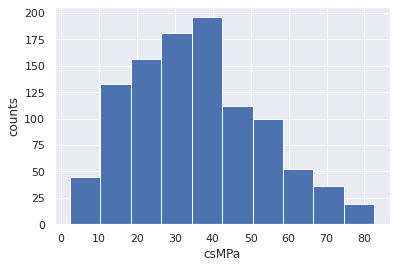
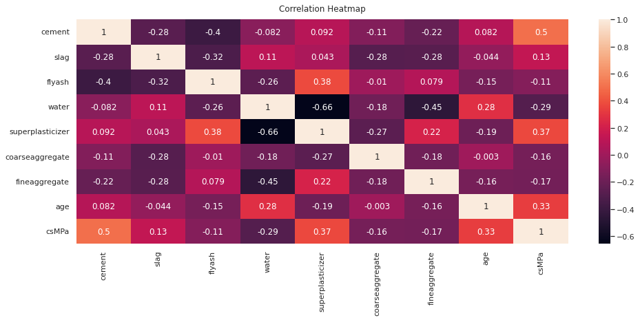
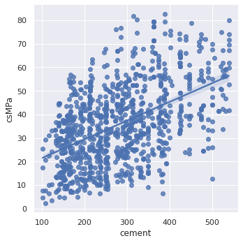
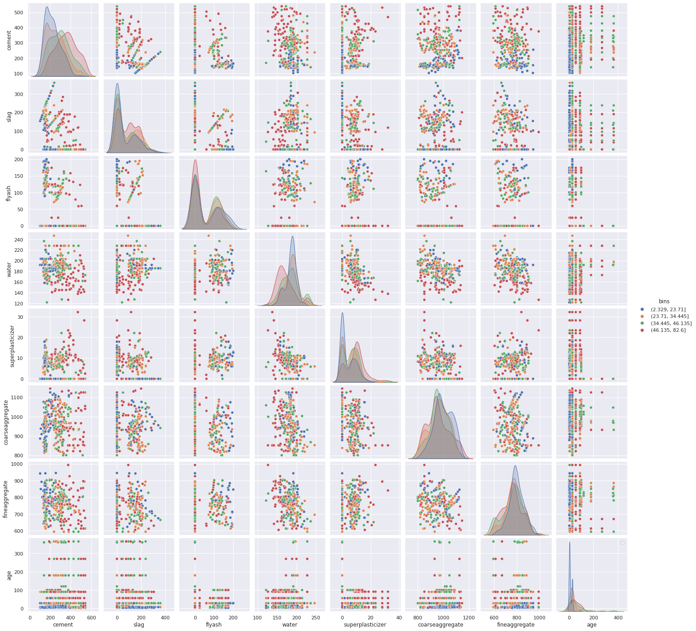
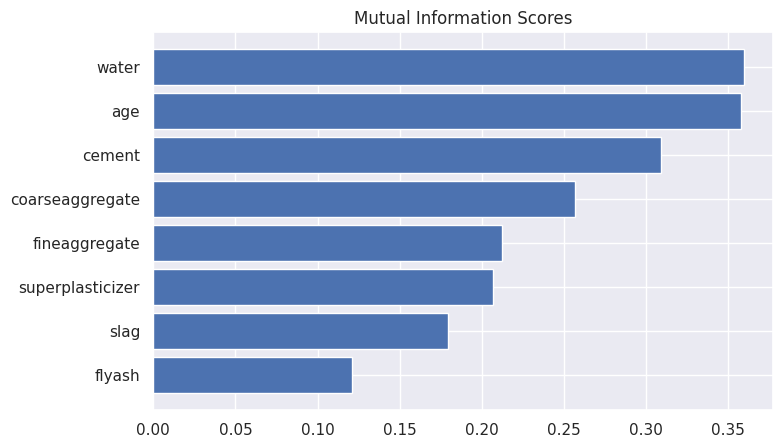
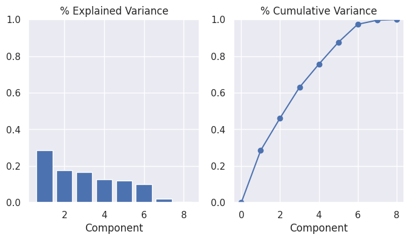
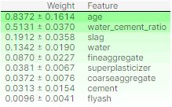
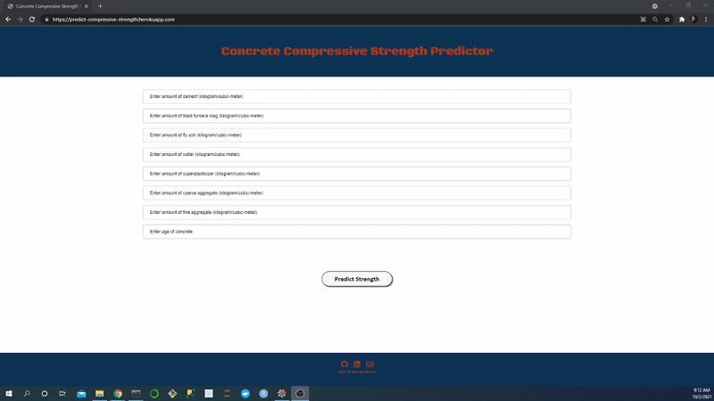

# Project Overview for Concrete Compressive Strength App

This repository is for the analysis and modeling done with the UCI concrete compressive strength dataset. Below you will find an overview of the data, code, and results. The goal was to create an end-to-end project where I create a pipeline to perform an exploratory data analysis (EDA), feature engineer, apply machine learning algorithms to predict concrete compressive strength, and create a [deployed application with a front-end](https://predict-compressive-strength.herokuapp.com/) to productionize the best performing model. The repo with the Heroku files for the app can be found [here](https://github.com/michaelbryantds/concrete-strength-pred-app).

### Code Used 

**Python Version:** 3.7.10 <br />
**Packages:** pandas, numpy, scipy, sklearn, matplotlib, seaborn, flask, statsmodels, shap, eli5, pickle<br />
**For Web Framework Requirements:**  ```pip install -r requirements.txt```  

## Concrete Compressive Strength Dataset

The dataset was gathered from [Kaggle](https://www.kaggle.com/maajdl/yeh-concret-data). The dataset contains 9 variables and 1030 concrete samples.

### Variables

`cement`, `slag`, `flyash`, `water`, `superplasticizer`, `coarseaggregate`, `fineaggregate`, `age`, `csMPa`

## Files

### concrete-analysis-modeling.py

This file contains the EDA and feature engineering. The EDA is performed using descriptive statistics, histograms to determine univariate distributions, and a correlation heatmap using the Pearson correlation coefficient for bivariate analysis. A feature is engineered by creating a predictor based on water:cement ratio. Numerical features are scaled using MinMaxScaler. The scaler is pickled after fitting for use with productionization.

I hyperparameter tune: LinearRegression, RandomForestRegressor, GradientBoostingRegressor, and XGBRegressor. The models are hyperparameter tuned with GridSearchCV based on MAE and the best models are judged based on MSE, RMSE, MAE, and R-squared. This file also contains code to derive the feature importance from the best models using the eli5 package. The final XGBRegressor model is pickled for use with productionization.

## Results

### EDA

I looked at the distributions of the data and the correlations between variables. Below are some of the highlights:


<div align="center">
  
<figure>
<br/>
  <figcaption>Figure 1: Distribution of the target variable, compressive strength.</figcaption>
</figure>
<br/><br/>
  
</div>

<br/>
<br/>

<div align="center">
  
<figure>
<br/>
  <figcaption>Figure 2: Correlation heatmap for numerical variables using Pearson correlation coefficient.</figcaption>
</figure>
<br/><br/>
  
</div>

<br/>
<br/>

<div align="center">
  
<figure>
<br/>
  <figcaption>Figure 3: Compressive strength and cement have the strongest linear relationship according to the correlation heatmap.</figcaption>
</figure>
<br/><br/>
  
</div>

<br/>
<br/>

<div align="center">
  
<figure>
<br/>
  <figcaption>Figure 4: Pairplot demonstrating highly sparse data among some variables which makes a tree-based model a good choice.</figcaption>
</figure>
<br/><br/>
  
</div>

<br/>
<br/>

<div align="center">
  
<figure>
<br/>
  <figcaption>Figure 5: Mutual information scores (from 0 to 1) shows nonlinearity between predictors and compressive strength.</figcaption>
</figure>
<br/><br/>
  
</div>

<br/>
<br/>

<div align="center">
  
<figure>
<br/>
  <figcaption>Figure 6: Explained variance from PCA demonstrates low variance among variables (no visible elbow) and about the same amount of variance contribution per principal component for the first eight components.</figcaption>
</figure>
<br/><br/>
  
</div>

<br/>
<br/>

<div align="center">

<figure>
<br/>
  <figcaption>Figure 7: Ordinary least squares analysis demonstrates low R-squared scores (nonlinearity, again) and most important features being superplasticizer, water, cement, and age.</figcaption>
</figure>
<br/><br/>
  
</div>

  

### Feature Engineering

I feature engineered using the dataset for future modeling. I made the following changes:
* Created a feature by dividing `water` by `cement`

<div align="center">

<figure>
<br/>
  <figcaption>Figure 8: Compressive strength and water:cement ratio demonstrates inverse relationship (1/x) between the two variables.</figcaption>
</figure>
<br/><br/>
  
</div>

### Model Building

First, I split the data into train and tests sets with a test set size of 25%.

I then hyperparameter tuned 4 different models with five-fold cross-validation and evaluated them using MAE.

The models I chose and why:
* LinearRegression - simple and explainable
* RandomForestRegressor - sparse distributions
* GradientBoostingRegressor - like Random Forest, but with the ability to combat high variance (i.e., overfitting)
* XGBRegressor - like Gradient Boosting, but with regularization


### Model Performance

I looked tuned based on MAE, because it is robust against outliers and I don't need a differentiable function. However, after hyperparameter tuning, I did take into account other metrics (i.e., MSE, RMSE, and R-squared). The best model (based on MAE) was:
<br/><br/>
**XGBRegressor**
* MSE: 19.80 MPa<sup>2</sup>
* RMSE: 4.59 MPa
* MAE: 3.05 MPa
* R-squared: 0.93

### Feature Importance


<div align="center">
  
<figure>
<br/>
  <figcaption>Figure 9: Permutation importance for XGBRegressor showing age and water:cement ratio to be most important.</figcaption>
</figure>
<br/><br/>
  
</div>

## Productionization

I built a [Heroku web app](https://predict-compressive-strength.herokuapp.com/) with a front-end which takes concrete ingredients and age as input from the user and outputs a concrete compressive strength prediction using the XGBRegressor model. More information on this can be found at it's [repo](https://github.com/michaelbryantds/concrete-strength-pred-app).

<div align="center">
  
<figure>
<br/>
  <figcaption>Figure 8: Front-end of application using XGBRegressor.</figcaption>
</figure>
<br/><br/>
  
</div>

## Resources

1. [Kaggle: Concrete Compressive Strength](https://www.kaggle.com/maajdl/yeh-concret-data)
